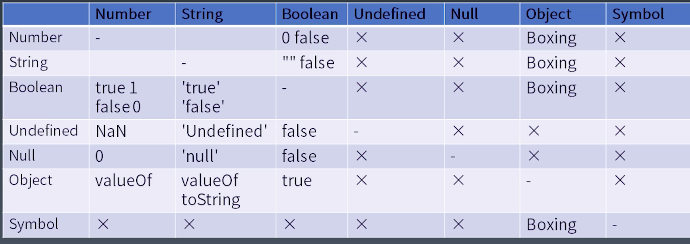

##### Grammar

#### Expressions

**Member**
- a.b a[b]（支持变量）成员访问
- foo`string`

- super.b super[b]

- new.target

- new Foo()

**New**
new foo

##### Referemce (引用类型)

Object

key (string symbol)
delete assgin

**call**

left handside（可以放左边expression） right handside
非lefthandside 则为right hanside 

Unary（单目运算符）
delete a.b
void foo()

typeo fa
+ a
- a
~a
!a  //  !! 把任何类型的数强制转换布尔类型)
await

**Exponental** 
**（右结合）**

- Multiplicataive
 */%
 additive
 +-
 shift 
 << >> >>>(带符号右移)
 relationship
 < > <= >= instanceof

 **Equality**
  == 类型转换
  !=
  ===
  !==

  bitwise
  &（按位与） ^（异或）  |（按位或）

  logical
  && ||（短路原则）

  Conditional
  ？ :

#### 类型转换

##### Unboxing 
- ToPrimitive 
var o = {
  toString() {return '2'}
  valueOf() {return 1}
  [Symbol.toPrimitive]() [return 3]
}

##### Boxing

Number New Number(1) 1
string new String('a') a
Boolean new Boolean(true) true
Symbol new Object(Symbol('a)) Symbol('a')

### statement

#### Completion Record
[[type]] normal break continue return or throw

[[value]] 基本类型

[[target]] label

##### 简单语句
ExpressionStatement表达式语句
EmptyStatemnet空语句
DebuggerStatement debugger语句

ThrowStatement 抛出异常
ContinueStatement 结束当次循环
BreakStatement 结束整个循环
ReturnStatement 返回函数值

##### 复合语句

BlockStatement 
IfStatement
SwitchStatement
ItertionStatement
WithStatemen
LabelledStatement
TryStatement

**block**
- BLockStatement      

#### 声明

宏任务 
任务源
微任务（promise）

js引擎
script
